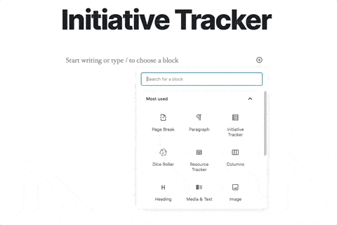

# Initiative Tracker #

## Description ##
This plugin provides the Initiative Tracker block, which can be used to organize PC (Player Character) and NPC (Non-Player Character) combat initiative scores for Table-Top Role-Playing Games.

Built with [WDS Block Starter](https://github.com/WebDevStudios/wds-block-starter) and [@webdevstudios/create-block](https://github.com/WebDevStudios/create-block).

## Installation ##
1. Upload the `initiative-tracker` folder to the `/wp-content/plugins` directory.
2. Activate the Initiative Tracker plugin through the 'Plugins' menu in WordPress.
3. Add the 'Initiative Tracker' block in a post or page.
4. Populate the Player and NPC lists with character, player, and initiative data.
5. Save and view your page or post.
6. Use the 'Next Character' button to iterate through active characters.

## Frequently Asked Questions ##

### How are the character lists ordered? ###
When the Initiative Tracker block is active (i.e., selected for editing) in the block editor, characters are divided into Players (PCs) and NPCs and sorted alphabetically in ascending order. Otherwise, both character lists are combined and sorted according to initiative score in descending order.

### How should I use this block? ###
This block is best for Game Masters who have a fairly good plan for the session's combat ahead of time. Prior to the start of the session, create a fresh page or post for the session and add an Initiative Tracker block. Populate the block with the players (PCs), then duplicate the block for as many combats you expect to encounter (this way you don't have to re-enter players for each block). Next, add the different NPCs for each encounter to each block – bonus: pre-roll your NPCs' initiative scores and enter those into the blocks ahead of time. Finally, during gameplay, input the players' initiative scores for the current round of combat, save your page or post, and flip to the frontend to iterate through the active characters.

### How can I report issues or suggest improvements? ###
Feel free to create an issue or PR in the [Github repo here](https://github.com/ravewebdev/initiative-tracker).

## Screenshots ##

### Admin Demo 1: Insert Initiative Tracker block ###

### Admin Demo 2: Add Combat Notes and Characters ###

### Frontend Demo: Cycle through active characters ###

## Changelog ##

### 2.0.0 ###
* Added: Implemented frontend editing of character initiative scores.
* Added: Created WP REST API route for editing initiative tracker blocks.
* Updated: Converted class components to function components.
* Updated: Simplified frontend character name and player name display.
* Removed: Removed notes field.

### 1.0.2 ###
* Fixed: Updated "current" character pointer to work across browsers.

### 1.0.1 ###
* Fixed: Cleaned up doc comments, updated block keywords, addressed linting errors.

### 1.0.0 ###
* Added: Create Initiative Tracker block with character sorting by name and initiative.
* Added: Create frontend 'current character' pointer and 'next character' button.
